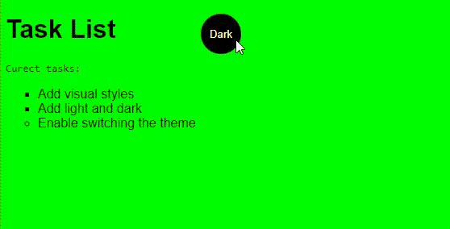

# Site Simples - Light/Dark Mode

### Abrir e rodar o projeto:

https://leandrocamilo09.github.io/SITE_SIMPLES_MUDANDO_TEMAS/

## "Status atual do projeto:

- Em andamento.

## Sobre o Projeto:

Um site apenas para estudar um método de mundanças de cores do site clicando em um botão.

## Equipe:

- `Leandro Camilo`

## Tecnologias utilizadas:

- `JavaScript`
- `HTML`
- `Css`
